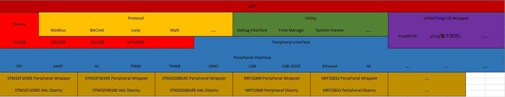

# LittleThings
After working as firmware engineer for some years, I wan to write a platform. Therefore, I can put some peripheral driver, MCU drivers and protocol which are accumulated in my engineer career. After I summarized, I want them to be reused conveniently anywhere.

### Why it is named by LittleThings
Because my daughter's pet name is "xiao shi er", I choose LittleThings as name of my platform. As a firmware engineer, I think this is the best way to impress my love to her.

### Operation System
We can find so many embedded operation system, so I think it is not very wise that I write a embedded operation system. Therefore, I choose FreeRTOS as my embedded operation system. Now I need to port it. The version of FreeRTOS is 10.4.6 .

### LittleThings Platform Structure

1. APP layer is used to put application code and user of this platform should change this layer. In this layer, I will put some demo code to give some guidance to the user
2. Device layer is used to put Device driver. I will put robust driver which is used in my career in this layer and the user don't need to change this layer
3. Protocol layer is used to put some common protocol. 
4. Utility layer is used to put some useful component such as debug interface/ time manager. In addition, I will put some component like computing distance or motor controllor and so on.
5. LittleThings OS Wrapper layer is used to implement the common API interface of the common embedded operation system like FreeRTOS, uCOS and so on. Currently this platform just support FreeRTOS. In the future, if I have time, I will make the platform support uCOS rtThread and other common embedded operation system.
6. Peripheral Interface layer will implement common API of the common peripheral like SPI, UART, IIC, TIMER, GPIO and so on.
7. The lowest layer is microchip layer which is in the bottom of the picture. This layer is implemented by the user and I will put some common microchip demo in this layer.